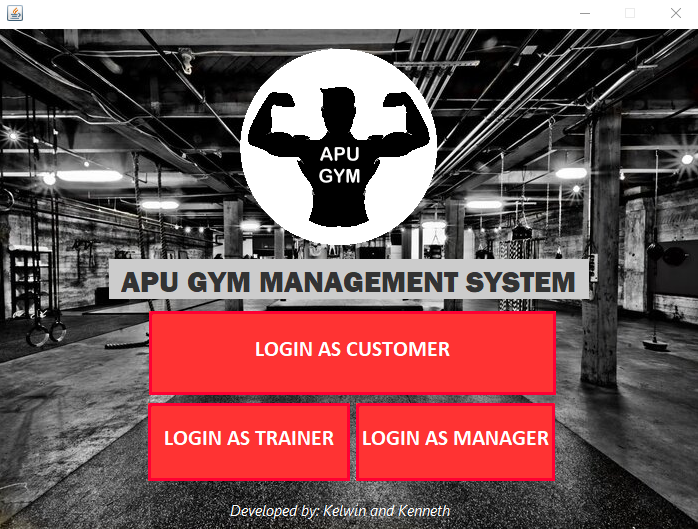

# Gym-Management-System
The APU Gym Centre Management System (AGC) is a gym management software that aims to provide APU Gym Centre with a better implementation of a system that could unleash its full potential growth by streamlining a series of business processes. The objectives of developing the system are to manage the end users’ records and handle daily operations of the gym center more efficiently and productively.

